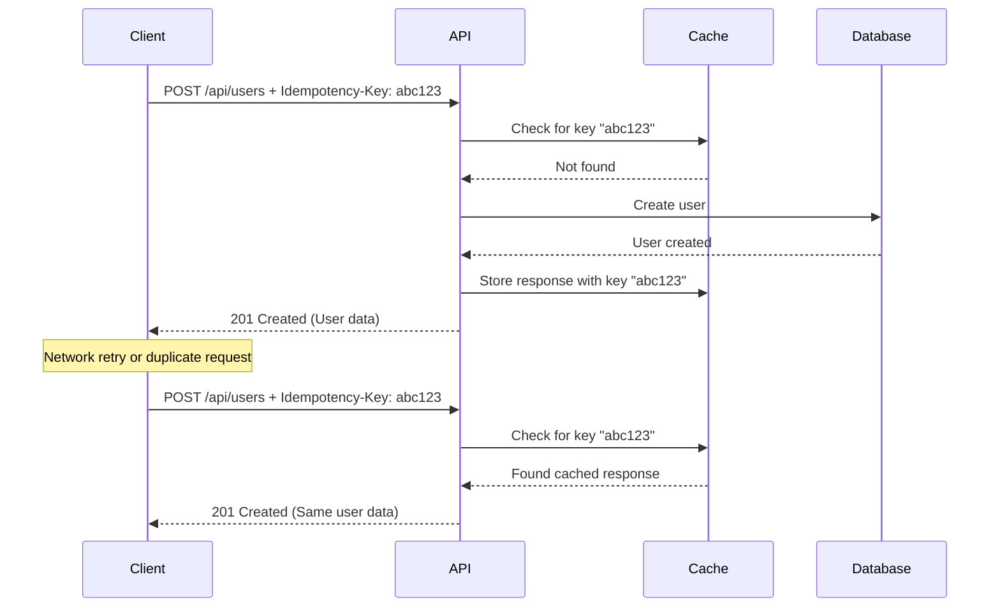

# Idempotency Guide

## Overview

Idempotency is a critical feature in distributed systems that ensures the same operation produces the same result when performed multiple times. This prevents duplicate transactions, data corruption, and unintended side effects from network retries or user errors.

## Table of Contents

1. [What is Idempotency?](#what-is-idempotency)
2. [Why Idempotency Matters](#why-idempotency-matters)
3. [How It Works](#how-it-works)
4. [Configuration](#configuration)
5. [Usage Guide](#usage-guide)
6. [Best Practices](#best-practices)
7. [API Reference](#api-reference)
8. [Troubleshooting](#troubleshooting)

## What is Idempotency?

Idempotency ensures that multiple identical requests have the same effect as a single request. When a client sends a request with an idempotency key, the server:

1. **First Request**: Processes the request and stores the response with the key
2. **Duplicate Requests**: Returns the cached response without reprocessing

### Key Benefits

- **Prevents Duplicate Transactions**: No double charges or duplicate records
- **Network Resilience**: Safe retries during network failures
- **Data Integrity**: Maintains consistent state despite failures
- **User Experience**: Prevents errors from accidental double-clicks

## Why Idempotency Matters

### Real-World Scenarios

#### 1. Payment Processing
```
User clicks "Pay $100" → Network timeout → User clicks again
Without idempotency: Charged $200
With idempotency: Charged $100 (second request returns cached result)
```

#### 2. User Registration
```
Registration form submitted → Server processes → Network fails before response
Client retries → Without idempotency: "Email already exists" error
With idempotency: Returns successful registration response
```

#### 3. API Integration
```
Webhook sends event → Your server processes → Fails to acknowledge
Webhook retries → Without idempotency: Duplicate processing
With idempotency: Recognizes duplicate and returns cached response
```

## How It Works

### Request Flow



### Key Components

1. **Idempotency Key**: Unique identifier for the request (UUID recommended)
2. **Cache Storage**: Redis/Valkey stores key-response pairs
3. **TTL (Time to Live)**: How long to cache responses
4. **Status Tracking**: Processing, completed, or failed states

## Configuration

### Global Settings

Idempotency is automatically enabled for critical endpoints:

| Endpoint | Default TTL | Description |
|----------|------------|-------------|
| POST /auth/register | 24 hours | User registration |
| POST /auth/refresh | 1 minute | Token refresh |
| POST /auth/api-keys | 24 hours | API key creation |

### Entity-Level Configuration

Each entity can have custom idempotency settings:

```typescript
// When creating an entity
{
  name: "orders",
  displayName: "Orders",
  schema: { /* ... */ },
  idempotencyEnabled: true,
  idempotencyTtl: 3600000, // 1 hour in milliseconds
  idempotencyMethods: ["POST", "PUT"]
}
```

### TTL Options

- **1 minute** (60,000 ms): Token refresh, temporary operations
- **5 minutes** (300,000 ms): Quick transactions
- **1 hour** (3,600,000 ms): Standard API operations
- **24 hours** (86,400,000 ms): User registration, important operations
- **7 days** (604,800,000 ms): Long-running processes

## Usage Guide

### Client Implementation

#### JavaScript/TypeScript
```typescript
import { v4 as uuidv4 } from 'uuid';

// Generate unique key for each logical operation
const idempotencyKey = uuidv4();

// Include in request headers
const response = await fetch('/api/v1/orders', {
  method: 'POST',
  headers: {
    'Content-Type': 'application/json',
    'Idempotency-Key': idempotencyKey, // or 'X-Idempotency-Key'
  },
  body: JSON.stringify(orderData)
});

// Safe to retry with same key if needed
if (!response.ok) {
  // Retry with same idempotencyKey
  await retryRequest(idempotencyKey);
}
```

#### Using API Client
```typescript
import { ApiClient } from '@base/api-client';

const client = new ApiClient({
  baseUrl: 'http://localhost:3001/api/v1'
});

// Register with idempotency
const response = await client.auth.register({
  email: 'user@example.com',
  password: 'SecurePass123!'
}, {
  headers: {
    'Idempotency-Key': 'unique-key-123'
  }
});
```

#### cURL Example
```bash
curl -X POST http://localhost:3001/api/v1/auth/register \
  -H "Content-Type: application/json" \
  -H "Idempotency-Key: unique-key-123" \
  -d '{
    "email": "user@example.com",
    "password": "SecurePass123!"
  }'
```

### Admin UI Configuration

1. **Navigate to Entity Builder**
   - Go to APIs → Entity Builder
   - Select an entity or create new

2. **Enable Idempotency**
   - Toggle "Idempotency Settings" switch
   - Select appropriate TTL
   - Choose which HTTP methods to protect

3. **Visual Indicators**
   - Entities with idempotency show a shield badge
   - Hover for configuration details

## Best Practices

### DO's ✅

1. **Generate Unique Keys per Operation**
   ```typescript
   // Good: New key for each logical operation
   const createOrder = async (data) => {
     const key = uuidv4();
     return await api.post('/orders', data, {
       headers: { 'Idempotency-Key': key }
     });
   };
   ```

2. **Store Keys for Retry Logic**
   ```typescript
   // Store key for potential retries
   localStorage.setItem('lastOrderKey', idempotencyKey);
   ```

3. **Use Appropriate TTLs**
   - Short (1-5 min): Temporary operations
   - Medium (1-24 hours): Standard operations
   - Long (1-7 days): Critical operations

4. **Include Keys in Webhooks**
   ```typescript
   // Webhook sender
   await sendWebhook({
     url: 'https://api.example.com/webhook',
     headers: {
       'Idempotency-Key': `webhook-${eventId}`
     },
     data: eventData
   });
   ```

### DON'Ts ❌

1. **Don't Reuse Keys Across Different Operations**
   ```typescript
   // Bad: Same key for different operations
   const key = "static-key-123";
   await api.createUser(userData, { headers: { 'Idempotency-Key': key }});
   await api.createOrder(orderData, { headers: { 'Idempotency-Key': key }}); // Wrong!
   ```

2. **Don't Use Predictable Keys**
   ```typescript
   // Bad: Predictable keys
   const key = `user-${userId}`; // Can cause conflicts
   
   // Good: Unique keys
   const key = `user-${userId}-${uuidv4()}`;
   ```

3. **Don't Apply to GET Requests**
   ```typescript
   // Unnecessary: GET requests are already idempotent
   await api.get('/users', {
     headers: { 'Idempotency-Key': 'key-123' } // Not needed
   });
   ```

## API Reference

### Headers

| Header | Description | Example |
|--------|-------------|---------|
| `Idempotency-Key` | Standard idempotency header | `Idempotency-Key: 550e8400-e29b-41d4-a716-446655440000` |
| `X-Idempotency-Key` | Alternative header format | `X-Idempotency-Key: 550e8400-e29b-41d4-a716-446655440000` |

### Response Headers

| Header | Description | Example |
|--------|-------------|---------|
| `X-Idempotent-Replayed` | Indicates cached response | `X-Idempotent-Replayed: true` |

### Error Responses

#### Idempotency Conflict (409)
```json
{
  "type": "https://api.example.com/errors/idempotency-conflict",
  "title": "Idempotency Key Conflict",
  "status": 409,
  "detail": "Request with this idempotency key is already being processed",
  "instance": "/api/v1/orders"
}
```

## Troubleshooting

### Common Issues

#### 1. "Idempotency key already used" Error
**Cause**: Key was used for a different request
**Solution**: Generate a new unique key

#### 2. Duplicate Processing Despite Idempotency Key
**Cause**: TTL expired between requests
**Solution**: Increase TTL or retry sooner

#### 3. Different Responses for Same Key
**Cause**: Cache was cleared or TTL expired
**Solution**: This is expected behavior after TTL expiration

### Debugging

1. **Check if endpoint supports idempotency**
   ```bash
   curl -I -X POST http://localhost:3001/api/v1/endpoint
   # Look for idempotency-related headers in response
   ```

2. **Verify key format**
   - Must be string
   - Recommended: UUID v4
   - Max length: 255 characters

3. **Monitor cache status**
   - Check Redis/Valkey for key existence
   - Verify TTL settings

### Performance Considerations

- **Cache Size**: Each cached response uses memory
- **TTL Balance**: Longer TTL = more memory, shorter TTL = less protection
- **Cleanup**: Automatic cleanup runs hourly to remove expired keys

## Examples

### E-commerce Order Creation
```typescript
class OrderService {
  async createOrder(items: CartItem[], customerId: string) {
    // Generate unique key for this order attempt
    const idempotencyKey = `order-${customerId}-${Date.now()}-${uuidv4()}`;
    
    try {
      const response = await api.post('/api/v1/orders', {
        customerId,
        items,
        total: calculateTotal(items)
      }, {
        headers: {
          'Idempotency-Key': idempotencyKey
        }
      });
      
      // Store key for potential status checks
      await redis.set(`order:${response.id}:key`, idempotencyKey);
      
      return response;
    } catch (error) {
      // Safe to retry with same key
      if (isRetryable(error)) {
        return await this.retryWithKey(idempotencyKey, items, customerId);
      }
      throw error;
    }
  }
}
```

### Webhook Processing
```typescript
app.post('/webhook', async (req, res) => {
  const idempotencyKey = req.headers['idempotency-key'] || 
                         req.headers['x-idempotency-key'];
  
  if (!idempotencyKey) {
    return res.status(400).json({ error: 'Idempotency key required' });
  }
  
  // Process webhook with idempotency protection
  const result = await processWebhook(req.body, idempotencyKey);
  res.json(result);
});
```

### Batch Operations
```typescript
async function batchImport(records: any[]) {
  const results = [];
  
  for (const record of records) {
    // Unique key per record
    const key = `import-${record.id}-${Date.now()}`;
    
    const result = await api.post('/api/v1/entities/products/records', record, {
      headers: { 'Idempotency-Key': key }
    });
    
    results.push({
      record: record.id,
      idempotencyKey: key,
      result
    });
  }
  
  return results;
}
```

## Security Considerations

1. **Key Uniqueness**: Always use cryptographically secure random generators
2. **Key Storage**: Don't log idempotency keys with sensitive data
3. **TTL Settings**: Balance between memory usage and protection duration
4. **Rate Limiting**: Idempotency doesn't bypass rate limits
5. **User Isolation**: Keys are scoped per endpoint, not per user

## Further Reading

- [RFC 7231 - Idempotent Methods](https://tools.ietf.org/html/rfc7231#section-4.2.2)
- [Stripe Idempotency](https://stripe.com/docs/api/idempotent_requests)
- [AWS API Gateway Idempotency](https://aws.amazon.com/builders-library/making-retries-safe-with-idempotent-APIs/)